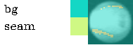

# Seam segmentation with mobilenet-unet

keras-preprocessing.ipynb script allows me to create the desired data/folder structure to use train.py

    
    ├── dataset1          
      ├── annotations_prepped_test  
      ├── annotations_prepped_train  
      ├── images_prepped_test                                               
      ├── images_prepped_train                    

I saved the google colab that I worked as a .ipynb, you can check seam_segmentation_w_keras_mobilenet_unet.ipynb for that.

Here are some of the results.

  |  
:-------------------------:|:-------------------------:
Input             |  Output

|  | 
|:--:| 
| Input-Output 1 |

|  | 
|:--:| 
| Input-Output 2 |

|  | 
|:--:| 
| Input-Output 3 |

|  | 
|:--:| 
| Multiple Input-Output |

  |  
:-------------------------:|:-------------------------:
Multiple Inputs            |  Multiple Outputs

## Working Google Colab Examples:
* Python Interface: https://colab.research.google.com/drive/1q_eCYEzKxixpCKH1YDsLnsvgxl92ORcv?usp=sharing
* CLI Interface: https://colab.research.google.com/drive/1Kpy4QGFZ2ZHm69mPfkmLSUes8kj6Bjyi?usp=sharing

### Prerequisites

* Keras ( recommended version : 2.4.3 )
* OpenCV for Python
* Tensorflow ( recommended  version : 2.4.1 )

## More information about anything can be found at [image-segmentation-keras](https://github.com/divamgupta/image-segmentation-keras). 

